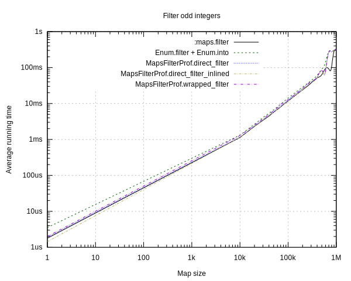

# MapsFilterProf

This project contains benchmarking code to profile various implementations of a `Map.filter/2` function.

Implementations:

- `:maps.filter(pred, map_or_iter)`: The baseline we benchmark against. Expects a two-parameter function, which goes against Elixir idioms, where a two-element tuple would be used instead.
- `MapsFilterProf.wrapped_filter(map_or_iter, fun)`: Wraps `:maps.filter/2`, to adapt it to a two-element tuple input.
- `MapsFilterProf.direct_filter(map_or_iter, fun)`: Re-implements `:maps.filter/2` directly, with the assumption that this might be more performant than wrapping a function with an extra intermediate anonymous function.
- `MapsFilterProf.direct_filter_inlined(map_or_iter, fun)`: Similar to `direct_filter/2`, but inlines the other fnctions the other implementation would call from the `:maps` module as well (most importantly: `next/1` which is called once per map element). This is done since local function calls are usually faster (and more often optimized by the compiler) than inter-module function calls.


## Running the benchmark on your own machine

```bash
# NOTE: This will take 12+ minutes
mix run benchmarks/benchmarks.exs
mix run benchmarks/export_graphs.exs
```

## Results



It can clearly be seen from this graph that the difference in implementations is very small.
Especially the difference between `direct_filter_inlined/2` vs. `:maps.filter/2` is neglegible.
`wrapped_filter/2` is, as was expected, a little bit (averaging at ~20-40%) slower than the former two.

On average, the `direct_filter_inlined/2` seems to be slightly faster than the non-inlined version.
This difference is small, but significant (i.e. reproducible across benchmark re-runs).


